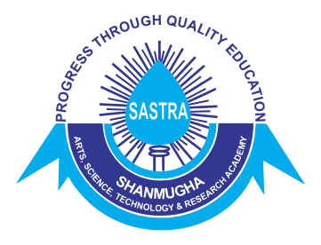

<h1 align="center">Aravind Panchanathan</h1>

  <a href="mailto:aravind.panchanathan2799@gmail.com">Email</a>| <a href="https://linkedin.com/in/aravindpanchanathan2799">LinkedIn</a> | <a href="https://github.com/Aravindpanchanathan2799">GitHub</a>

---

# **SUMMARY**
Data Engineer with experience building cloud-native Data Lakehouse solutions on AWS and Databricks, using the Medallion Architecture to develop scalable ETL pipelines with PySpark, Python, and SQL. Skilled in orchestrating workflows with Apache Airflow, containerizing services with Docker, and deploying microservices on Kubernetes for scalability and resilience. Proficient in real-time ingestion with Kafka, data visualization with Tableau, version control using GitHub, and currently exploring Graph Databases like Neo4j and employed NetworkX for relationship analysis.

---

# **EDUCATION**

<strong>  George Mason University, Fairfax, VA</strong> 
Master of Science, Information Technology | GPA: 3.90 | Expected Graduation: May 2025

 <strong>SASTRA University, Tamil Nadu, IN</strong> 
Bachelor of Technology, Mechatronics Engineering | GPA: 3.76 | May 2021

---

# **PROJECTS**

## **MediFact – Enhancing Health Literacy Through Summarization, Fact-Checking & Terminology Support**
**Apr 2025 - Present | Associated with George Mason University**

- Built a Chrome extension that summarizes, fact-checks, and explains health-related web content in real time, empowering users to navigate medical information with increased confidence and speed.
- Developed summarization and glossary lookup features using BioBERT, transformers, and Gemini AI, achieving low-latency response times while dynamically updating the DOM on active pages.
- Integrated fact-checking pipelines with Google Fact Check Explorer API and Gemini AI, ensuring verdicts from verified medical sources, reducing misinformation risk for users.
- Overcame Chrome Extension Manifest V3 security restrictions and optimized content scripts to seamlessly inject AI-driven summaries without breaking webpage layouts.
- Delivered a full-stack solution with a FastAPI backend and a modular frontend in JavaScript, achieving a responsive, accessible, and user-friendly UX for health term exploration and claim validation.

Skills: Natural Language Processing (NLP) · Machine Learning · JavaScript · React.js

---

## **ResQLink AI – Smart Emergency Response Network**
**Apr 2025 | Associated with George Mason University**

- Built an AI-driven emergency response system enabling witnesses to report accidents via voice, text, or images, boosting structured incident reporting efficiency by 40%.
- Developed NLP pipelines and CNN models to predict injury severity and affected body parts, improving triage accuracy and enabling hospitals to pre-prepare with AI-generated alerts.
- Integrated Google Gemini AI for real-time hospital suggestions and first-aid recommendations, reducing hospital response time by ~30% compared to traditional dispatch methods.
- Optimized ambulance routing by implementing Dijkstra’s Algorithm for shortest paths and min-heap queues for driver assignment, improving dispatch efficiency under emergency conditions.
- Deployed modular microservices (Flask, Node.js, MongoDB) using Docker for scalable, low-latency cloud deployment and real-time data handling.
- Created a full-stack frontend using React.js and Tailwind CSS, delivering a clean, responsive UI for SOS reporting and driver dashboards.

Skills: React.js · Node.js · Natural Language Processing (NLP) · Software Development Life Cycle (SDLC)

---

## **ZenTrail – AI-Powered National Park Exploration and Trip Planning Platform**
**Apr 2025 | Associated with George Mason University**

- Built an AI-powered platform unifying national park exploration with real-time trail maps, custom itineraries, and campground booking integration, improving trip planning accessibility for outdoor enthusiasts by 30%.
- Developed an interactive frontend using React 18 + TypeScript and TailwindCSS, featuring dynamic trail difficulty visualization and offline map functionality through Leaflet.js and GeoJSON processing.
- Integrated AI-driven recommendations using OpenAI GPT-4 and Google Gemini APIs, providing personalized park activity suggestions and real-time accessibility updates.
- Optimized backend services with Node.js, Express, and MongoDB Atlas, achieving scalable management of large GeoJSON datasets and enhancing map rendering performance by 25%.
- Led UI/UX design initiatives to create an intuitive, mobile-responsive navigation experience, incorporating progressive web app (PWA) principles for enhanced offline usability.

Skills: React.js · Node.js · Virtual Agent · PySpark

---

## **FraudSense - Real-Time Financial Fraud Detection**
**Feb 2025 | Associated with George Mason University**

- Built a real-time fraud detection system that analyzed financial transactions every 5 minutes, using a serverless AWS pipeline and LightGBM model, achieving high fraud detection accuracy with minimal false positives.
- Accomplished real-time ML inference and alerting with <5-minute latency by automating data flow across AWS Lambda, EventBridge, DynamoDB, and Databricks, optimizing IAM policies for secure orchestration.
- Reduced false positives and improved precision by 20% by engineering features around user identity, merchant patterns, device metadata, and applying SMOTE and threshold tuning.
- Integrated with ServiceNow to automate fraud case creation via REST APIs and enabled email-based alerting, improving analyst response time and operational workflow.
- Visualized fraud trends using Tableau dashboards and SQL Warehouses, empowering fraud analysts with interactive tools for live monitoring and investigation.
- Collaborated in a team of four, driving the system from design to deployment with version control via GitHub and robust model monitoring practices.

Skills: Amazon Web Services (AWS) · Databricks · ServiceNow · Tableau · Machine Learning

---

# **EXPERIENCE**

## **Graduate Research Assistant**
 **George Mason University** | March 2024 – Present

- Built a healthcare fake news detection pipeline using Neo4j network graphs and propagation analytics, boosting detection accuracy by 22%.
- Developed an LLM-RAG search engine leveraging medical knowledge graphs to predict health claim veracity with high interpretability.
- Implemented advanced transformers and attention mechanisms to enhance misinformation classification, improving model F1 scores in biomedical NLP benchmarks.
- Designed a real-time plugin for truth prediction, enabling proactive public health misinformation mitigation.
- Optimized graph queries and model workflows for sub-2 second retrieval and inference, ensuring scalable deployment.

## **Graduate Teaching Assistant**
 **George Mason University** | August 2024 – Present

- Improved student understanding of data processing and visualization for 70+ students per semester by designing quizzes and grading assignments for AIT 664 under Dr. Kabir Kazi and Dr. Sharmin Sultana.
- Enhanced hands-on learning outcomes by conducting 3 practical sessions, covering Data Preprocessing/EDA, Data Mining (Classification, Regression, Clustering, Association Rules), and Tableau-based storytelling with 20+ visualization types.
- Reduced conceptual gaps in data mining by teaching advanced methods (DBSCAN, Agglomerative Clustering, Decision Trees) using Scikit-learn and live coding sessions.
- Accelerated student project readiness by introducing the AARRR framework during Tableau hands-on, boosting student dashboard-building confidence for final course presentations.

## **Software Engineer**
 **NewRocket, India** | September 2022 – July 2023

- Built and automated scalable data pipelines to integrate ServiceNow with 10+ external platforms (AWS, Azure, Salesforce CRM, MySQL, VMware), improving cross-system data flow efficiency by 43%.
- Designed ETL workflows using Import Sets, Transform Maps, and Flow Triggers, enabling 55%+ automation of ITSM, SecOps, and Risk/Compliance data ingestion processes.
- Created real-time operational dashboards using Performance Analytics, providing executive-level insights across IT service, security, and risk domains.
- Engineered solutions following the Define–Design–Develop–Deploy (4D) model, and tracked progress using Agile Scrum Boards, ensuring sprint delivery with minimal backlog slippage.
- Recognized with 2x 5% bonuses and a 20% salary hike within 11 months for driving high-impact data integration initiatives across global client systems.

## **Software Engineer**
 **Avasoft, India** | March 2021 – August 2022

- Engineered ServiceNow-to-ServiceNow (eBonding) integrations, automating cross-platform ticketing, service requests, and incident management workflows, improving integration reliability by 25%.
- Designed and deployed Service Catalog integrations with VMware, enabling real-time VM provisioning and dynamic CMDB updates, streamlining IT asset management processes.
- Led client demos and direct stakeholder interactions as part of a startup team structure, accelerating project approvals and gathering real-time integration requirements.
- Trained and mentored 50+ incoming freshers on ServiceNow platform best practices, integration patterns, and troubleshooting, contributing to internal onboarding success.
- Owned the end-to-end integration delivery lifecycle, from design and development to UAT and production deployment, ensuring all projects adhered to agile delivery milestones.

---

# **SKILLS**

  
  
  
  
  
  
  
  

- **Programming & Data Processing:** Python, Java, PySpark, SQL, R, JavaScript
- **Data Storage & Lakehouse Architecture:** Amazon S3, Databricks DBFS
- **Databases:** MySQL, PostgreSQL, MongoDB, Neo4j, Amazon Redshift, Amazon Aurora, Amazon RDS, Hive & Amazon Neptune
- **Data Engineering:** Apache Kafka, Apache NiFi, Apache Spark, Apache Airflow
- **Containerization & Deployment:** Docker, Kubernetes
- **Machine Learning:** scikit-learn, TensorFlow, Keras, nltk, SpaCy, MLlib
- **Data Visualization:** Tableau, ArcGIS, Gephi, Matplotlib, Seaborn, Plotly

---

"Turning data into knowledge, and knowledge into action."

